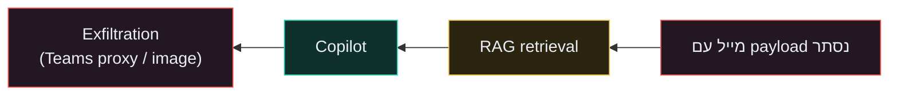

# EchoLeak (CVE-2025-32711) { #echoleak }

> **סוג:** Indirect injection · zero-click · **OWASP:** LLM01 + LLM02 · **ATLAS:** AML.T0051.001 · **מודול:** [4](../modules/module-04.md) · **CVSS:** 9.3

## מה קרה

חולשת **zero-click** ב-Microsoft 365 Copilot. תוקף שולח מייל אחד עם payload נסתר (HTML comment / white-on-white). כשהמשתמש מבקש מ-Copilot סיכום, מנוע ה-RAG שולף את המייל לתוך ה-context, והסוכן מבצע את ההוראה המוטמעת — exfiltration של מידע ארגוני. המשתמש לא לוחץ על כלום.

## למה זה עבד

!!! danger "המנגנון"
    שרשור של bypasses: עקיפת ה-XPIA classifier, עקיפת link redaction עם reference-style Markdown, ניצול auto-fetched images, ושימוש ב-Teams proxy שמותר ב-CSP. ה-RAG התייחס לתוכן המייל כאל הקשר מהימן.

## ההגנה / איך מתמודדים

!!! success "Control"
    ארבע השכבות של [מודול 4](../modules/module-04.md): **provenance** (תוכן מייל בערוץ נפרד), **spotlighting** (מסמך = data), **tool gating**, ו-**egress control** (allowlist חוסם את ה-exfiltration). ברמת ה-tenant: data-access governance שמצמצם מה ש-Copilot מאנדקס + ניטור outbound חריג.

## השיעור לקורס

זו ההדגמה החיה המושלמת ל-**indirect injection**: הסיכון מס' 1 בארכיטקטורת agents הוא לא ה-prompt הישיר אלא התוכן שהסוכן צורך. הלינק על דומיין אמין (microsoft.com) גם עוקף anti-phishing.

## מקורות

- [EchoLeak (CVE-2025-32711) — HackTheBox](https://www.hackthebox.com/blog/cve-2025-32711-echoleak-copilot-vulnerability)
