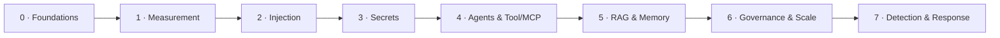

---
hide:
  - navigation
  - toc
---

# AI Security for Solutions Architects

> בנה אותו כדי לתקוף — כדי שתדע להגן. קורס מודולרי לאבטחת מערכות **LLM** ו-**Agents**, ממופה ל-**OWASP LLM Top 10 (2025)** ול-**MITRE ATLAS**, ומבוסס על [RedTeamProject](https://github.com/Amitro123/RedTeamProject).

-   :material-target:{ .lg .middle } __העיקרון המכונן__

    ---

    מודל לא מבדיל בין **instructions** ל-**data**. הכול מגיע כזרם טוקנים אחד — זו הזרקת SQL בשפה טבעית. כל הגנה היא ניסיון לשחזר את ההפרדה מבחוץ.

-   :material-recycle:{ .lg .middle } __הלולאה__

    ---

    `attack → measure → harden → measure → detect → respond`. ה-**delta** (leak rate לפני/אחרי) הוא המספר שחשוב לארכיטקט.

-   :material-account-tie:{ .lg .middle } __שני מסלולים__

    ---

    🟢 Track A — מנהלי/לא-טכני: סיכון, אחריות, החלטות.
    🔵 Track B — ארכיטקטים/מפתחים: קוד, labs, harness.

-   :material-shield-lock:{ .lg .middle } __8 מודולים__

    ---

    מיסודות, דרך injection, agents ו-RAG, ועד governance ו-**Detection & Response**.

## מסלול הלמידה

## מאיפה להתחיל

-   __חדש כאן?__ התחל ב-[מודול 0 · Foundations](modules/module-00.md)
-   __ארכיטקט?__ קפוץ ל-[מודול 4 · Agents & Tool/MCP](modules/module-04.md)
-   __מנהל?__ קרא את העדשה הניהולית (Track A) בכל מודול
-   __רוצה לתרגל?__ פתח את [המעבדות](labs/index.md)

## מסגרת קבועה בכל מודול

כל עמוד מודול בנוי על אותו שלד: **Overview** · **Track A / Track B** · **Threat / Control / Evidence** · **RACI** · **Outcomes** · **Lab**.

!!! tip "חומרי עזר"
    [OWASP LLM Top 10](reference/owasp-llm-top-10.md) · [MITRE ATLAS](reference/mitre-atlas.md) · [Metrics & CI Gates](reference/metrics-ci-gates.md) · [Glossary](reference/glossary.md) · [Case Studies](case-studies/index.md)
