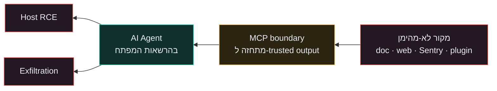

# Module 4 · Agents, Excessive Agency & Tool/MCP Security { #module-4 }

> **OWASP:** LLM06 (Excessive Agency) + LLM05 (Improper Output Handling) + LLM01 (Indirect) · **ATLAS:** AML.T0051.001 · **משך:** ~60 דק' (Track A) / +45 דק' lab (Track B)

## Overview

זהו המודול החשוב ביותר למי שבונה **agents**. סוכן לא רק עונה — הוא **פועל**: שולח מיילים, מריץ קוד, ניגש לנתונים. לכן הסיכון המרכזי כאן הוא **indirect prompt injection**: ה-payload מגיע ממסמך שהסוכן קורא (RAG, web, פלט כלי) ולא מהמשתמש. המודול מוסיף שכבת **Tool/MCP Security Architecture** — כי ב-2026 משטח התקיפה זז מהמודל אל הכלים והזהות של הסוכן.

## Track A / Track B

=== "🟢 Track A — מנהלי"

    **שלוש הכותרות הקבועות:**

    - **Attack surface:** כל מסמך/כלי/MCP שהסוכן צורך — לא רק ה-input הישיר.
    - **"המודל מסרב" אינו control:** indirect injection לא עובר דרך המשתמש בכלל, אז אין למי לסרב.
    - **אחריות ארגונית:** מפת אחריות בין **service ↔ tool ↔ agent ↔ user** — מי אחראי לכל גבול.

    **מה מציגים להנהלה:** שיעור הצלחת התקיפה לפני/אחרי 4 השכבות, ומספר הכלים בעלי side-effect ללא human-approval.

=== "🔵 Track B — טכני"

    **Lab outline:** הרצת `vulnerable_agent.py` מול `defended_agent.py` גב-אל-גב, והרחבת ההגנה עם tool gating + policy enforcement. → ראה [Lab 4](../labs/lab-04-agents.md).

    **מה מטמיעים:** provenance על פלט כלים, tool gating (HITL), per-tool scopes, ו-egress allowlist.

### Tool / MCP Security Architecture

!!! defense "ארבע שכבות ההגנה (`defended_agent.py`)"
    1. **Provenance** — תוכן לא-מהימן מועבר בנפרד, לא משורשר לזרם ההוראות.
    2. **Spotlighting** — ה-system prompt מכריז שתוכן מסמך הוא `data`, לעולם לא instructions.
    3. **Tool Gating** — פעולות side-effect (`send_email`) דורשות אישור אנושי (HITL).
    4. **Egress Control** — שליחה רק ל-allowlisted domains; חוסם exfiltration גם בכשל מלא.

בנוסף לארבע השכבות, שכבת ה-Tool/MCP דורשת:

- **Authentication / Authorization** על כל endpoint — כולל `localhost` (לקח AutoJack).
- **Egress allowlist** + **tool manifests** + **signatures** לכלים.
- **Sandboxing**, **per-tool scopes**, ו-**policy enforcement** על כל tool call.
- כל פלט MCP מטופל כ-**untrusted data**, לא כ-system output (לקח Agentjacking).

## Threat / Control / Evidence

!!! danger "Threat model"
    **נכנס:** מסמכי RAG, דפי web, פלט כלים/MCP. **סומכים על:** כלום מתוכם. **הגבול:** הסוכן והכלים שלו, כולל localhost.

!!! success "Control"
    4 השכבות (provenance · spotlighting · tool gating · egress) + auth/scopes/sandbox על כל כלי.

!!! info "Evidence"
    התקיפה מצליחה ב-`vulnerable_agent` ונחסמת ב-`defended_agent`; log של כל tool call עם provenance; 0 כלים בעלי side-effect ללא HITL.

## RACI

| נכס | Owner | Accountable | Responsible | Consulted | Informed |
| --- | --- | --- | --- | --- | --- |
| Tools / MCP | Architect | Eng Lead | Dev | Security | Product |
| Agent prompts | Architect | Eng Lead | Dev | Security | Product |
| Egress policy | Security Eng | CISO | Dev | Architect | Management |

## Outcomes

- 🟢 **Track A:** משרטט מפת אחריות `service / tool / agent / user` ומציג את הירידה בשיעור הצלחת התקיפה.
- 🔵 **Track B:** מטמיע tool gating, per-tool scopes, ו-egress allowlist, ומדגים חסימה ב-`defended_agent`.

## Lab

ראה [Lab 4 · Agents](../labs/lab-04-agents.md).

## Case studies & reference

- [EchoLeak (CVE-2025-32711)](../case-studies/echoleak.md) · Agentjacking · AutoJack
- [OWASP LLM06 / LLM05](../reference/owasp-llm-top-10.md) · [Glossary](../reference/glossary.md) · [Metrics & CI Gates](../reference/metrics-ci-gates.md)
